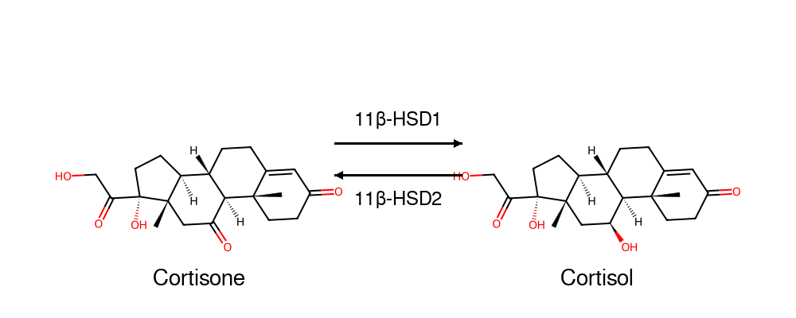
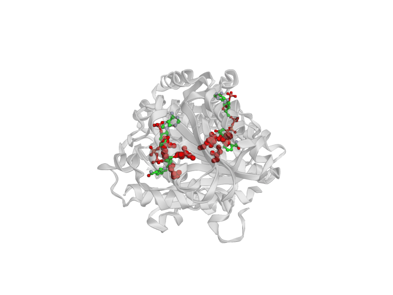

# Bericht: Vergleich von Cortisol und Cortison

## Chemischer Vergleich

| Eigenschaft | Cortisol | Cortisone |
| --- | --- | --- |
| PubChem CID | 5754 | 222786 |
| Summenformel | C21H30O5 | C21H28O5 |
| Molekulargewicht (g/mol) | 362.5 | 360.4 |
| SMILES | C[C@]12CCC(=O)C=C1CC[C@@H]3[C@@H]2[C@H](C[C@]4([C@H]3CC[C@@]4(C(=O)CO)O)C)O | C[C@]12CCC(=O)C=C1CC[C@@H]3[C@@H]2C(=O)C[C@]4([C@H]3CC[C@@]4(C(=O)CO)O)C |

## Molekulare Strukturen

### Cortisol

Cortisol, oft als „Stresshormon“ bezeichnet, ist ein Steroidhormon, das in den Nebennieren produziert wird. Es spielt eine entscheidende Rolle bei der Regulierung verschiedener Prozesse im Körper, einschließlich des Stoffwechsels, der Immunantwort und der Reaktion des Körpers auf Stress. Es ist das primäre Glucocorticoid beim Menschen.

#### Kalottenmodell (Spacefilling)
| Vorderansicht | Rückansicht | Draufsicht |
| :---: | :---: | :---: |
|  |  |  |

#### 3D-Kalotten-Animation

#### 2D-Modell

### Cortison

Cortison ist ein Steroidhormon, das eng mit Cortisol verwandt ist. Es ist biologisch inaktiv und muss durch das Enzym 11β-Hydroxysteroid-Dehydrogenase Typ 1 (11β-HSD1) in Cortisol umgewandelt werden, um seine Wirkung zu entfalten. Es wird häufig als Medikament zur Hemmung von Entzündungen und zur Behandlung verschiedener Erkrankungen eingesetzt.

#### Kalottenmodell (Spacefilling)
| Vorderansicht | Rückansicht | Draufsicht |
| :---: | :---: | :---: |
|  |  |  |

#### 3D-Kalotten-Animation

#### 2D-Modell

---

# Medizinischer Vergleich: Cortisol vs. Cortison

## Übersicht
Cortisol und Cortison sind eng verwandte Corticosteroide, unterscheiden sich jedoch in ihrer biologischen Aktivität und Potenz.

## Biologische Aktivität
- **Cortisol (Hydrocortison)**: Die biologisch aktive Form des Hormons. Es kann direkt an Glucocorticoid-Rezeptoren binden, um seine Wirkung zu entfalten.
- **Cortison**: Ein Prodrug (biologisch inaktiv). Es muss in Cortisol umgewandelt werden, um aktiv zu werden.

## Aktivierungsweg
Die Umwandlung von Cortison in Cortisol wird durch das Enzym **11β-Hydroxysteroid-Dehydrogenase Typ 1 (11β-HSD1)** vermittelt, das sich hauptsächlich in der Leber befindet, aber auch in anderen Geweben wie dem Fettgewebe und dem Gehirn vorkommt. Umgekehrt wird Cortisol durch **11β-HSD2**, vor allem in den Nieren, wieder in Cortison umgewandelt.

#### 3D-Enzym-Animation

*Hinweis: Die Animation zeigt das menschliche 11β-HSD1-Enzym (PDB 1XU7). Zur Veranschaulichung der Bindungstasche für Cortison/Cortisol ist der steroidähnliche Inhibitor BVT (magenta) sowie der Cofaktor NDP (grün) eingebettet.*

## Medizinische Qualität und pharmakologische Eigenschaften
Die medizinische Qualität dieser Moleküle wird durch ihre biologische Aktivität und therapeutische Wirksamkeit definiert.
- **Cortisol (Hydrocortison)**: Als aktives Hormon stellt es den primären Vermittler von Glucocorticoid-Effekten dar. Seine „medizinische Qualität“ liegt in seiner sofortigen Verfügbarkeit für die Rezeptorbindung, was es für die akute Ersatztherapie und Notsituationen (z. B. Adrenalkrise) unerlässlich macht.
- **Cortison**: Seine Qualität als Medikament ist durch seine Rolle als Prodrug gekennzeichnet. Es erfordert eine metabolische Aktivierung, was zu einem langsameren Wirkungseintritt im Vergleich zur direkten Cortisol-Verabreichung führt. Dies macht es geeignet für chronische Erkrankungen, bei denen eine gleichmäßigere, weniger akute Wirkung erwünscht ist.

## Relative Potenz
- **Cortisol**: Relative Potenz = 1 (Referenzstandard).
- **Cortison**: Relative Potenz ≈ 0,8. Cortison gilt im Allgemeinen als etwas weniger potent als Cortisol, da eine enzymatische Aktivierung erforderlich ist.

## Signalkette
Der Signalweg von Cortisol (und aktiviertem Cortison) umfasst mehrere unterschiedliche Stadien:
1. **Zelleintritt**: Da Cortisol lipophil ist, diffundiert es frei durch die Zellmembran in das Zytoplasma.
2. **Rezeptorbindung**: Im Zytoplasma bindet Cortisol an den **Glucocorticoid-Rezeptor (GR)**, der normalerweise durch einen Chaperon-Komplex, bestehend aus **HSP90**, **HSP70** und **FKBP4**, in einem inaktiven Zustand gehalten wird.
3. **Aktivierung**: Die Bindung löst die Dissoziation dieser Chaperon-Proteine aus, was zu einer Konformationsänderung und Dimerisierung des Rezeptors führt.
4. **Nukleare Translokation**: Der aktivierte Cortisol-GR-Komplex transloziert in den Zellkern.
5. **Biologische Reaktion**:
    - **Transaktivierung**: Der Komplex bindet an spezifische DNA-Sequenzen, die als **Glucocorticoid-Response-Elements (GREs)** bezeichnet werden, und stimuliert die Transkription von entzündungshemmenden und metabolischen Genen.
    - **Transrepression**: Der Komplex kann auch die Aktivität anderer Transkriptionsfaktoren wie **NF-κB** oder **AP-1** stören und dadurch die Expression proinflammatorischer Gene unterdrücken.

## Therapeutische Anwendungsfälle
### Cortisol (Hydrocortison)
- **Nebenniereninsuffizienz**: Primäre Behandlung der Addison-Krankheit.
- **Akute allergische Reaktionen**: Wird für eine schnelle Wirkung bei schweren Allergien eingesetzt.
- **Topische Anwendungen**: Häufig in Cremes gegen Hautentzündungen und Juckreiz.

### Cortison
- **Gelenk- und Sehnenentzündungen**: Wird häufig durch lokale Injektion verabreicht (z. B. bei Schleimbeutelentzündung oder Arthritis).
- **Systemische Entzündungen**: Wird oral bei verschiedenen Autoimmun- und Entzündungskrankheiten eingesetzt, bei denen ein Prodrug-Ansatz akzeptabel ist.

## Hauptunterschiede
| Merkmal | Cortisol (Hydrocortison) | Cortison |
|---------|---------------------------|-----------|
| **Form** | Aktives Hormon | Inaktives Prodrug |
| **Primärer Wirkort** | Systemisch / Gewebe | Muss in Leber/Gewebe aktiviert werden |
| **Halbwertszeit** | ~1,5 - 2 Stunden | Etwas länger (aufgrund der Umwandlung) |
| **Mineralocorticoid-Aktivität** | Hoch (vergleichsweise) | Niedrig |

---

## Bedeutung in der Schwangerschaft

Die Schwangerschaft ist eine kritische Phase, in der das Gleichgewicht zwischen Cortisol und Cortison streng reguliert werden muss, um eine ordnungsgemäße fötale Entwicklung zu gewährleisten und den Fötus vor den potenziell schädlichen Auswirkungen überschüssiger mütterlicher Glucocorticoide zu schützen.

### Fötaler Schutz und die Plazentaschranke

Die Plazenta fungiert als selektive Barriere und reguliert den Transfer von Hormonen von der Mutter zum Fötus. Eine Schlüsselkomponente dieser Barriere ist das Enzym **11β-Hydroxysteroid-Dehydrogenase Typ 2 (11β-HSD2)**.

- **Mütterliches Cortisol**: Hohe Cortisolspiegel im Kreislauf der Mutter sind für verschiedene physiologische Anpassungen während der Schwangerschaft notwendig. Eine übermäßige Exposition kann jedoch für den sich entwickelnden Fötus schädlich sein und potenziell zu einem niedrigen Geburtsgewicht oder einer entwicklungsbedingten Programmierung von Krankheiten im Erwachsenenalter führen.
- **Enzymatische Umwandlung**: Das plazentare 11β-HSD2-Enzym wandelt aktives **Cortisol** effizient in inaktives **Cortison** um. Dies stellt sicher, dass der Fötus viel niedrigeren Spiegeln an aktiven Glucocorticoiden ausgesetzt ist als im mütterlichen Blut vorhanden sind, wodurch die sich entwickelnden Organe effektiv „abgeschirmt“ werden.

### Fötale Organreifung

Während der Schutz vor überschüssigem Cortisol lebenswichtig ist, ist ein rechtzeitiger Anstieg des fötalen Cortisolspiegels für die Reifung verschiedener Organsysteme, insbesondere gegen Ende der Trächtigkeit, unerlässlich.

- **Lungenreifung**: Cortisol spielt eine entscheidende Rolle bei der Produktion von **Surfactant** in der fötalen Lunge. Surfactant reduziert die Oberflächenspannung in den Alveolen, sodass sich die Lunge nach der Geburt ausdehnen und richtig funktionieren kann.
- **Vorbereitung auf die Geburt**: Erhöhte Cortisolspiegel lösen auch die Reifung der Leber (für die Glucoseproduktion), des Darms (für die Nährstoffaufnahme) und des Schilddrüsensystems aus und bereiten den Fötus auf den Übergang zum extrauterinen Leben vor.

Zusammenfassend lässt sich sagen, dass die durch 11β-HSD-Enzyme in der Plazenta und im fötalen Gewebe vermittelte gegenseitige Umwandlung von Cortisol und Cortison ein grundlegender Mechanismus ist, der eine gesunde Schwangerschaft und einen erfolgreichen Übergang bei der Geburt steuert.

---

# Zugehörige Organe und Proteine: Cortisol und Cortison

## Zugehörige Organe

### Nebennieren
Die **Nebennierenrinde**, insbesondere die *Zona fasciculata*, ist der Hauptort der Cortisolproduktion. Als Reaktion auf Stress oder niedrigen Blutzuckerspiegel gibt sie Cortisol in den Blutkreislauf ab.

### Leber
Die Leber ist ein zentraler Knotenpunkt für den Stoffwechsel dieser Steroide. Sie ist der Hauptort, an dem **Cortison über das Enzym 11β-HSD1 in aktives Cortisol umgewandelt wird**. Sie übernimmt auch die Inaktivierung und Konjugation dieser Hormone für die Ausscheidung.

### Hypothalamus und Hypophyse
Diese Gehirnstrukturen regulieren den Cortisolspiegel über die **HPA-Achse** (Hypothalamus-Hypophysen-Nebennierenrinden-Achse) und dienen als primäres Kontrollzentrum für die Cortisolproduktion.
- **Hypothalamus**: Setzt als Reaktion auf Stress oder zirkadiane Signale das **[Corticotropin-releasing Hormone (CRH)](https://www.proteinatlas.org/ENSG00000147571-CRH)** frei. Er kann auch **[Arginin-Vasopressin (AVP)](https://www.proteinatlas.org/ENSG00000101200-AVP)** freisetzen, das synergistisch mit CRH wirkt.
- **Vorderlappen der Hypophyse**: Wird durch CRH und AVP stimuliert und gibt **[adrenocorticotropes Hormon (ACTH)](https://www.proteinatlas.org/ENSG00000115138-POMC)** in den Blutkreislauf ab.
- **Andere kontrollierende Faktoren**: Hormone wie **[Ghrelin](https://www.proteinatlas.org/ENSG00000157017-GHRL)** (das „Hungerhormon“) können ebenfalls die Freisetzung von ACTH stimulieren und anschließend den Cortisolspiegel erhöhen.
- **Negative Rückkopplung**: Hohe Spiegel an zirkulierendem Cortisol hemmen die Freisetzung von sowohl CRH aus dem Hypothalamus als auch ACTH aus der Hypophyse und gewährleisten so das hormonelle Gleichgewicht.

### Nieren
Die Nieren spielen eine entscheidende Rolle beim Schutz des Körpers vor übermäßiger Mineralocorticoid-Aktivität. Obwohl Cortisol sowohl an Glucocorticoid- als auch an Mineralocorticoid-Rezeptoren binden kann, verwenden die Nieren das Enzym **11β-HSD2**, um Cortisol in inaktives Cortison umzuwandeln und so zu verhindern, dass es die Mineralocorticoid-Rezeptoren in den Nierentubuli übermäßig aktiviert.

---

## Zugehörige Proteine und Enzyme

### Enzyme: Das 11β-HSD-System
- **11β-Hydroxysteroid-Dehydrogenase Typ 1 (11β-HSD1)**: Wandelt hauptsächlich inaktives Cortison in aktives Cortisol um. Es kommt in der Leber, im Fettgewebe und im Gehirn vor.
- **11β-Hydroxysteroid-Dehydrogenase Typ 2 (11β-HSD2)**: Wandelt hauptsächlich aktives Cortisol in inaktives Cortison um. Es wird stark in den Nieren exprimiert, um zu verhindern, dass Cortisol die Mineralocorticoid-Rezeptoren überstimuliert.

### Rezeptoren
- **Glucocorticoid-Rezeptor (NR3C1 / GR)**: Der primäre Rezeptor, über den Cortisol seine metabolischen und entzündungshemmenden Wirkungen entfaltet.
    - **Verteilung**: Wird ubiquitär in fast allen Geweben exprimiert. Eine hohe Expression wird in Corticotrophen, Neutrophilen und der Leber beobachtet.
    - **Protein Atlas**: [NR3C1 Zusammenfassung](https://www.proteinatlas.org/ENSG00000113580-NR3C1)
- **Mineralocorticoid-Rezeptor (NR3C2 / MR)**: Obwohl primär für Aldosteron vorgesehen, hat Cortisol eine hohe Affinität zu diesem Rezeptor. Seine Wirkung hier wird durch 11β-HSD2 in spezifischen Geweben reguliert.
    - **Verteilung**: Stark exprimiert in den verbindenden und distalen gewundenen Nierentubuli, Somatotrophen und dem Plexus choroideus. Er ist wichtig für die Regulierung des Ionen- und Wassertransports.
    - **Protein Atlas**: [NR3C2 Zusammenfassung](https://www.proteinatlas.org/ENSG00000151623-NR3C2)

### Benachbarte Moleküle (Steroidgenese)
Cortisol ist ein Produkt des Steroid-Biosynthesewegs in der Nebennierenrinde. Seine Produktion umfasst mehrere „benachbarte“ Moleküle:
- **Vorläufer**:
    - **Cholesterin**: Der ursprüngliche Baustein.
    - **Pregnenolon**: Das erste Steroid in der Kette.
    - **Progesteron**: Wird in 17α-Hydroxyprogesteron umgewandelt.
    - **17α-Hydroxyprogesteron**: Ein wichtiges Zwischenprodukt.
    - **11-Desoxycortisol**: Der unmittelbare Vorläufer von Cortisol.
- **Enzymatische Umwandlung**: Der letzte Schritt in der Synthese von Cortisol ist die Umwandlung von 11-Desoxycortisol durch das Enzym **CYP11B1** (11β-Hydroxylase).

### Transportproteine
- **Corticosteroid-bindendes Globulin (CBG / Transcortin)**: Ein spezialisiertes Protein, das etwa 75-90 % des zirkulierenden Cortisols im Blut transportiert und dessen Verfügbarkeit für das Gewebe reguliert.
- **Albumin**: Ein unspezifisches Transportprotein, das einen kleineren Teil des zirkulierenden Cortisols bindet.

---

# Anhang: Cortisol-Ersatzmedikamente

Die folgende Tabelle listet gängige Medikamente auf, die in verschiedenen therapeutischen Kontexten als Ersatz für Cortisol verwendet werden, zusammen mit ihren Summenformeln, Vorteilen und Nachteilen.

| Medikament | Summenformel | Vorteile | Nachteile |
|------------|--------------|----------|-----------|
| Prednison | C21H26O5 | Kostengünstige, etablierte systemische Behandlung | Prodrug; erfordert metabolische Aktivierung in der Leber |
| Prednisolon | C21H28O5 | Biologisch aktive Form; geeignet für Patienten mit Leberfunktionsstörungen | Ähnliche systemische Nebenwirkungen wie andere Glucocorticoide |
| Dexamethason | C22H29FO5 | Sehr hohe Potenz; lang wirkend; minimale mineralocorticoide (salzhaltende) Aktivität | Starke Unterdrückung der HPA-Achse |
| Methylprednisolon | C22H30O5 | Geringere salzhaltende Wirkung als Cortisol; vielseitige Verabreichungswege | Risiko typischer corticosteroidbedingter Nebenwirkungen |
| Fludrocortison | C21H29FO5 | Extrem potente mineralocorticoide Aktivität; unerlässlich bei Nebenniereninsuffizienz | Erhebliches Risiko für Bluthochdruck und Ödeme, wenn nicht sorgfältig überwacht |
| Betamethason | C22H29FO5 | Hochpotent; lang wirkend; wird bei verschiedenen entzündlichen Zuständen eingesetzt | Starke Unterdrückung der HPA-Achse |
