# Report: Cortisol vs. Cortisone Comparison

## Chemical Comparison

| Property | Cortisol | Cortisone |
| --- | --- | --- |
| PubChem CID | 5754 | 222786 |
| Molecular Formula | C21H30O5 | C21H28O5 |
| Molecular Weight (g/mol) | 362.5 | 360.4 |
| SMILES | C[C@]12CCC(=O)C=C1CC[C@@H]3[C@@H]2[C@H](C[C@]4([C@H]3CC[C@@]4(C(=O)CO)O)C)O | C[C@]12CCC(=O)C=C1CC[C@@H]3[C@@H]2C(=O)C[C@]4([C@H]3CC[C@@]4(C(=O)CO)O)C |

## Molecular Structures

### Cortisol

Cortisol, often called the 'stress hormone,' is a steroid hormone produced by the adrenal glands. It plays a vital role in regulating various processes throughout the body, including metabolism, immune response, and the body's response to stress. It is the primary glucocorticoid in humans.

#### Spacefilling Model
| Front View | Backside View | Top View |
| :---: | :---: | :---: |
| 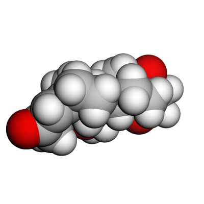 | 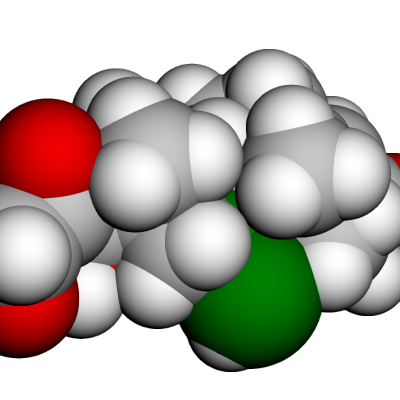 | 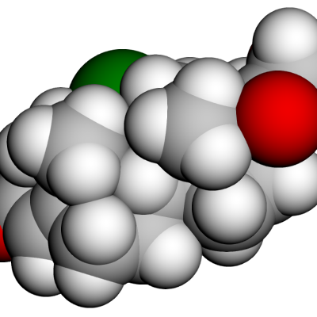 |

#### 3D Spacefilling Animation
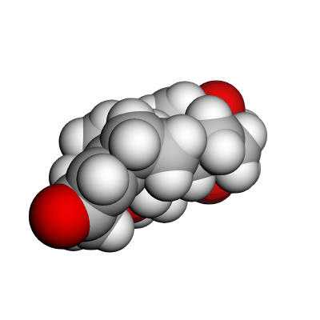

#### 2D and Pseudo-3D Stick Models
| 2D Model | Pseudo-3D Stick Model |
| :---: | :---: |
| 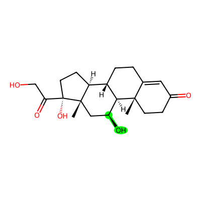 | 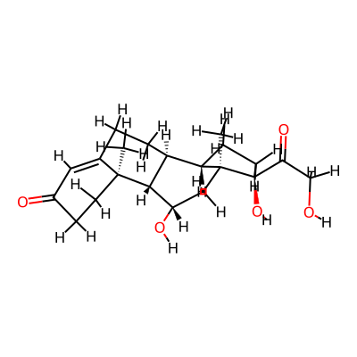 |

### Cortisone

Cortisone is a steroid hormone that is closely related to cortisol. It is biologically inactive and must be converted to cortisol by the enzyme 11β-hydroxysteroid dehydrogenase type 1 (11β-HSD1) to exert its effects. It is often used as a medication to reduce inflammation and treat various conditions.

#### Spacefilling Model
| Front View | Backside View | Top View |
| :---: | :---: | :---: |
| 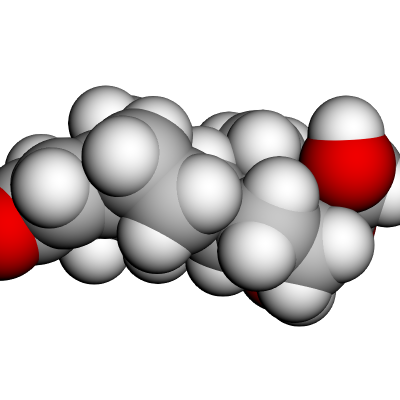 | 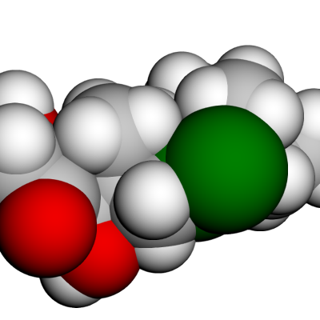 | 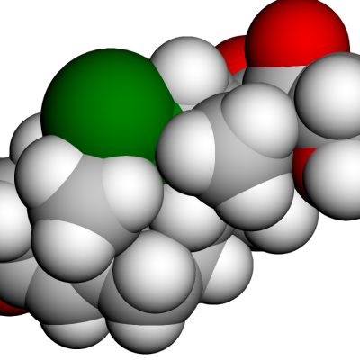 |

#### 3D Spacefilling Animation
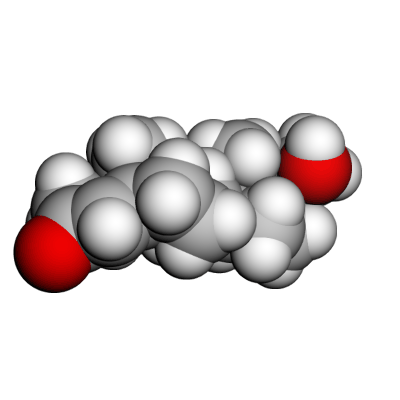

#### 2D and Pseudo-3D Stick Models
| 2D Model | Pseudo-3D Stick Model |
| :---: | :---: |
| 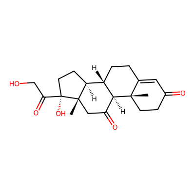 | 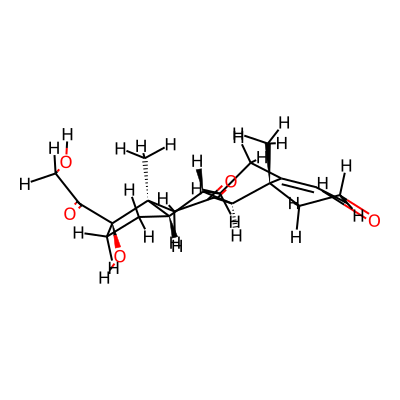 |

---

# Medical Comparison: Cortisol vs. Cortisone

## Overview
Cortisol and Cortisone are closely related corticosteroids, but they differ in biological activity and potency.

## Biological Activity
- **Cortisol (Hydrocortisone)**: The biologically active form of the hormone. It can directly bind to glucocorticoid receptors to exert its effects.
- **Cortisone**: A prodrug (biologically inactive). It must be converted into Cortisol to become active.

## Activation Pathway
The conversion of Cortisone to Cortisol is mediated by the enzyme **11β-hydroxysteroid dehydrogenase type 1 (11β-HSD1)**, which is primarily located in the liver but also found in other tissues like adipose tissue and the brain.

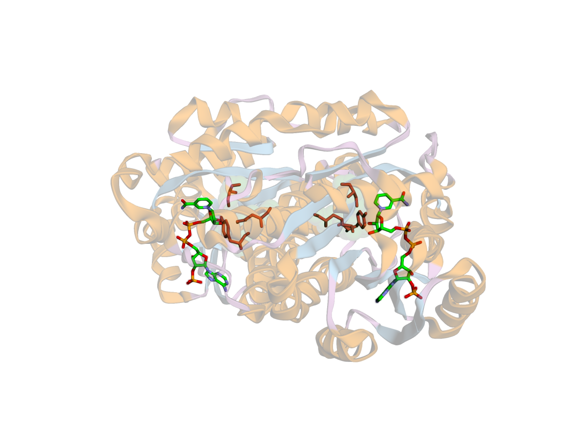

## Medical Quality and Pharmacological Properties
The medical quality of these molecules is defined by their biological activity and therapeutic efficacy.
- **Cortisol (Hydrocortisone)**: As the active hormone, it represents the primary mediator of glucocorticoid effects. Its "medical quality" lies in its immediate availability for receptor binding, making it essential for acute replacement therapy and emergency situations (e.g., adrenal crisis).
- **Cortisone**: Its quality as a medication is characterized by its role as a prodrug. It requires metabolic activation, which provides a slower onset of action compared to direct cortisol administration. This makes it suitable for chronic conditions where a steadier, less acute effect is desired.

## Relative Potency
- **Cortisol**: Relative Potency = 1 (Reference standard).
- **Cortisone**: Relative Potency ≈ 0.8. Cortisone is generally considered slightly less potent than Cortisol due to the requirement for enzymatic activation.

## Signaling Chain
The signaling pathway of Cortisol (and activated Cortisone) involves several distinct stages:
1. **Cellular Entry**: Being lipophilic, Cortisol diffuses freely across the cell membrane into the cytoplasm.
2. **Receptor Binding**: In the cytoplasm, Cortisol binds to the **Glucocorticoid Receptor (GR)**, which is typically held in an inactive state by a chaperone complex including **HSP90**, **HSP70**, and **FKBP4**.
3. **Activation**: Binding triggers the dissociation of these chaperone proteins, leading to a conformational change and dimerization of the receptor.
4. **Nuclear Translocation**: The activated Cortisol-GR complex translocates into the nucleus.
5. **Biological Response**:
    - **Transactivation**: The complex binds to specific DNA sequences called **Glucocorticoid Response Elements (GREs)**, stimulating the transcription of anti-inflammatory and metabolic genes.
    - **Transrepression**: The complex can also interfere with the activity of other transcription factors, such as **NF-κB** or **AP-1**, thereby repressing the expression of pro-inflammatory genes.

## Therapeutic Use Cases
### Cortisol (Hydrocortisone)
- **Adrenal Insufficiency**: Primary treatment for Addison's disease.
- **Acute Allergic Reactions**: Used for rapid effect in severe allergies.
- **Topical Applications**: Common in creams for skin inflammation and itching.

### Cortisone
- **Joint and Tendon Inflammation**: Often administered via local injection (e.g., for bursitis or arthritis).
- **Systemic Inflammation**: Used orally for various autoimmune and inflammatory conditions where a prodrug approach is acceptable.

## Key Differences
| Feature | Cortisol (Hydrocortisone) | Cortisone |
|---------|---------------------------|-----------|
| **Form** | Active Hormone | Inactive Prodrug |
| **Primary Site of Action** | Systemic / Tissues | Must be activated in Liver/Tissues |
| **Half-life** | ~1.5 - 2 hours | Slightly longer (due to conversion) |
| **Mineralocorticoid Activity** | High (comparatively) | Low |

---

## Importance in Pregnancy

Pregnancy is a critical period where the balance between cortisol and cortisone is tightly regulated to ensure proper fetal development while protecting the fetus from the potentially harmful effects of excess maternal glucocorticoids.

### Fetal Protection and the Placental Barrier

The placenta acts as a selective barrier, regulating the transfer of hormones from the mother to the fetus. A key component of this barrier is the enzyme **11β-hydroxysteroid dehydrogenase type 2 (11β-HSD2)**.

- **Maternal Cortisol**: High levels of cortisol in the mother's circulation are necessary for various physiological adaptations during pregnancy. However, excessive exposure can be detrimental to the developing fetus, potentially leading to low birth weight or developmental programming of adult diseases.
- **Enzymatic Conversion**: The placental 11β-HSD2 enzyme efficiently converts active **cortisol** into inactive **cortisone**. This ensures that the fetus is exposed to much lower levels of active glucocorticoids than those present in the maternal blood, effectively "shielding" the developing organs.

### Fetal Organ Maturation

While protection from excess cortisol is vital, a timely increase in fetal cortisol levels is essential for the maturation of various organ systems, particularly toward the end of gestation.

- **Lung Maturation**: Cortisol plays a pivotal role in the production of **surfactant** in the fetal lungs. Surfactant reduces surface tension in the alveoli, allowing the lungs to expand and function properly after birth.
- **Preparation for Birth**: Increased cortisol levels also trigger the maturation of the liver (for glucose production), the gut (for nutrient absorption), and the thyroid system, preparing the fetus for the transition to extrauterine life.

In summary, the interconversion of cortisol and cortisone, mediated by 11β-HSD enzymes in the placenta and fetal tissues, is a fundamental mechanism that orchestrates a healthy pregnancy and successful transition at birth.

---

# Related Organs and Proteins: Cortisol and Cortisone

## Related Organs

### Adrenal Glands
The **Adrenal Cortex**, specifically the *zona fasciculata*, is the primary site of Cortisol production. In response to stress or low blood-glucose, it releases Cortisol into the bloodstream.

### Liver
The liver is a major hub for the metabolism of these steroids. It is the primary site where **Cortisone is converted into active Cortisol** via the enzyme 11β-HSD1. It also handles the inactivation and conjugation of these hormones for excretion.

### Hypothalamus and Pituitary Gland
These brain structures regulate Cortisol levels through the **HPA axis** (Hypothalamic-Pituitary-Adrenal axis), serving as the primary control center for Cortisol production.
- **Hypothalamus**: Releases **Corticotropin-releasing hormone (CRH)** in response to stress or circadian signals. It may also release **Arginine Vasopressin (AVP)**, which acts synergistically with CRH.
- **Anterior Pituitary**: Stimulated by CRH and AVP, it releases **Adrenocorticotropic hormone (ACTH)** into the bloodstream.
- **Other Controlling Factors**: Hormones like **Ghrelin** (the "hunger hormone") can also stimulate the release of ACTH and subsequently increase Cortisol levels.
- **Negative Feedback**: High levels of circulating Cortisol inhibit the release of both CRH from the hypothalamus and ACTH from the pituitary, ensuring hormonal balance.

### Kidneys
The kidneys play a crucial role in protecting the body from excess mineralocorticoid activity. While Cortisol can bind to both Glucocorticoid and Mineralocorticoid receptors, the kidneys use the enzyme **11β-HSD2** to convert Cortisol into inactive Cortisone, preventing it from over-activating Mineralocorticoid receptors in the renal tubules.

---

## Related Proteins and Enzymes

### Enzymes: 11β-HSD System
- **11β-hydroxysteroid dehydrogenase type 1 (11β-HSD1)**: Primarily converts inactive Cortisone into active Cortisol. It is found in the liver, adipose tissue, and the brain.
- **11β-hydroxysteroid dehydrogenase type 2 (11β-HSD2)**: Primarily converts active Cortisol into inactive Cortisone. It is highly expressed in the kidneys to prevent Cortisol from over-stimulating mineralocorticoid receptors.

### Receptors
- **Glucocorticoid Receptor (NR3C1 / GR)**: The primary receptor through which Cortisol exerts its metabolic and anti-inflammatory effects.
    - **Distribution**: Ubiquitously expressed across almost all tissues. High expression is noted in corticotrophs, neutrophils, and the liver.
    - **Protein Atlas**: [NR3C1 Summary](https://www.proteinatlas.org/ENSG00000113580-NR3C1)
- **Mineralocorticoid Receptor (NR3C2 / MR)**: While primarily intended for aldosterone, Cortisol has a high affinity for this receptor. Its action here is regulated by 11β-HSD2 in specific tissues.
    - **Distribution**: Highly expressed in renal connecting and distal convoluted tubules, somatotrophs, and the choroid plexus. It is essential for regulating ion and water transport.
    - **Protein Atlas**: [NR3C2 Summary](https://www.proteinatlas.org/ENSG00000151623-NR3C2)

### Neighbouring Molecules (Steroidogenesis)
Cortisol is a product of the steroid biosynthetic pathway in the adrenal cortex. Its production involves several "neighbouring" molecules:
- **Precursors**:
    - **Cholesterol**: The initial building block.
    - **Pregnenolone**: The first steroid in the chain.
    - **Progesterone**: Converted into 17α-hydroxyprogesterone.
    - **17α-Hydroxyprogesterone**: A key intermediate.
    - **11-Deoxycortisol**: The immediate precursor to Cortisol.
- **Enzymatic Conversion**: The final step in the synthesis of Cortisol is the conversion of 11-deoxycortisol by the enzyme **CYP11B1** (11β-hydroxylase).

### Transport Proteins
- **Corticosteroid-binding globulin (CBG / Transcortin)**: A specialized protein that carries approximately 75-90% of circulating Cortisol in the blood, regulating its availability to tissues.
- **Albumin**: A non-specific transport protein that binds a smaller fraction of circulating Cortisol.

---

# Appendix: Cortisol Substitution Medications

The following table lists common medications used as substitutes for cortisol in various therapeutic contexts, along with their molecular formulas.

| Medication | Molecular Formula |
|------------|-------------------|
| Prednisone | C21H26O5 |
| Prednisolone | C21H28O5 |
| Dexamethasone | C22H29FO5 |
| Methylprednisolone | C22H30O5 |
| Fludrocortisone | C21H29FO5 |
| Betamethasone | C22H29FO5 |
