# Körpereigene Steroide

Diese Übersicht zeigt die wichtigsten körpereigenen Steroide als Kugel-Stäbchenmodelle.

| Name | Formel | Gewicht (g/mol) | 2D Modell | 3D Animation |
| :--- | :--- | :--- | :--- | :--- |
| Cholesterol | C27H46O | 386.7 | 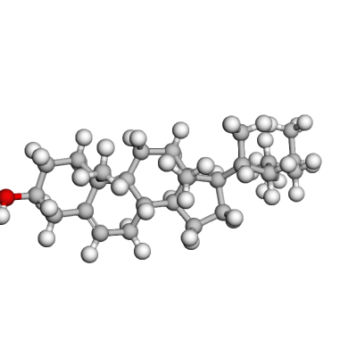 | 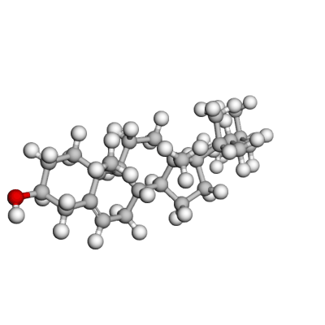 |
| Pregnenolone | C21H32O2 | 316.5 | 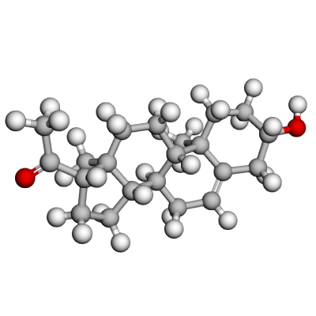 | 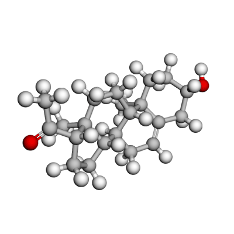 |
| Progesterone | C21H30O2 | 314.5 | 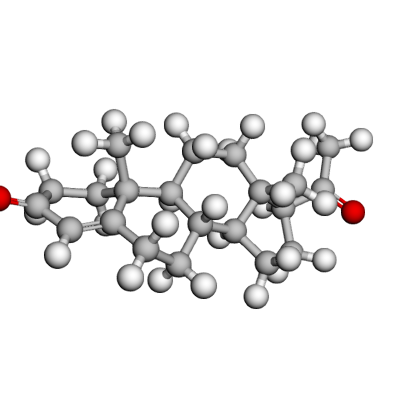 | 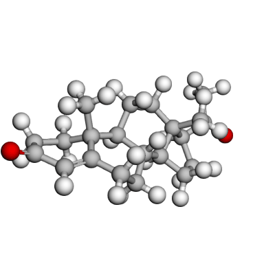 |
| 17-Hydroxyprogesterone | C21H30O3 | 330.5 | 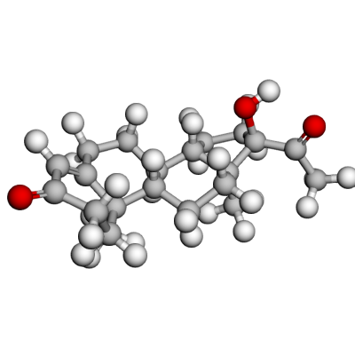 | 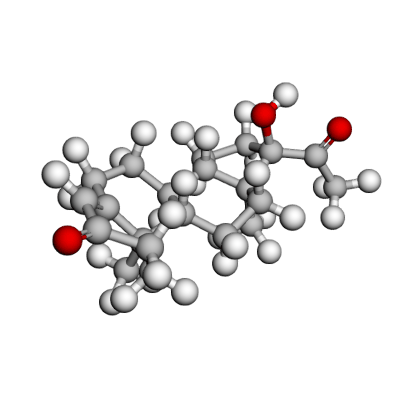 |
| Dehydroepiandrosterone | C19H28O2 | 288.4 | 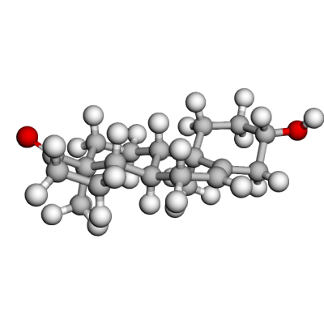 | 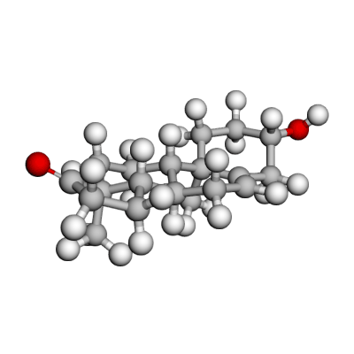 |
| Androstenedione | C19H26O2 | 286.4 | 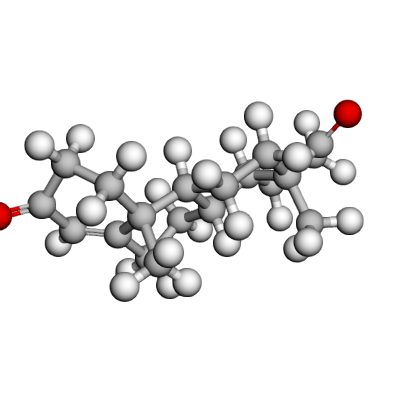 | 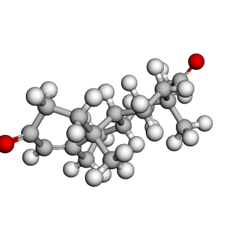 |
| Testosterone | C19H28O2 | 288.4 | 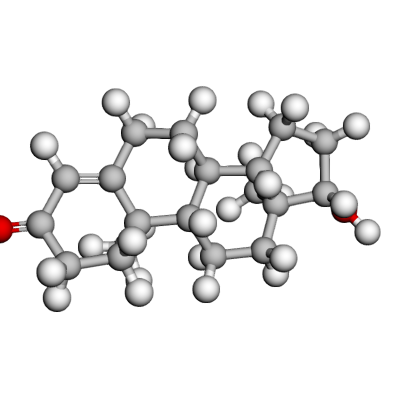 | 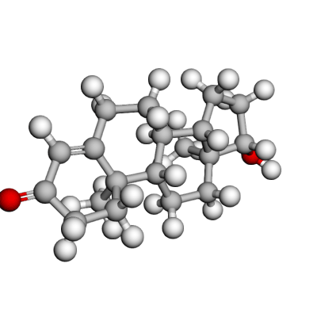 |
| Dihydrotestosterone | C19H30O2 | 290.4 | 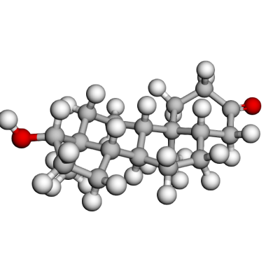 | 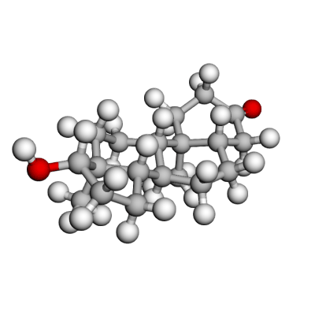 |
| Estrone | C18H22O2 | 270.4 | 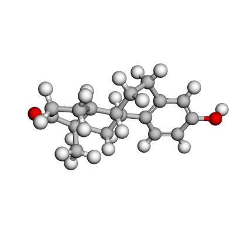 | 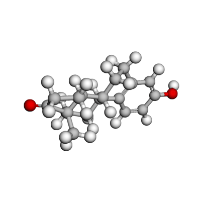 |
| Estradiol | C18H24O2 | 272.4 | 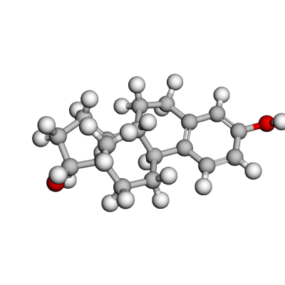 | 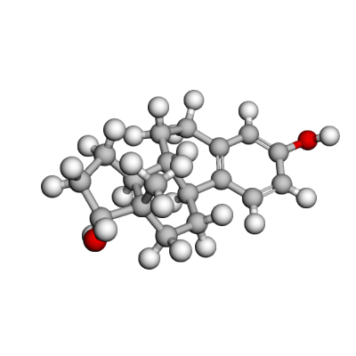 |
| Estriol | C18H24O3 | 288.4 | 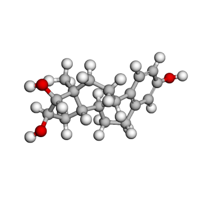 | 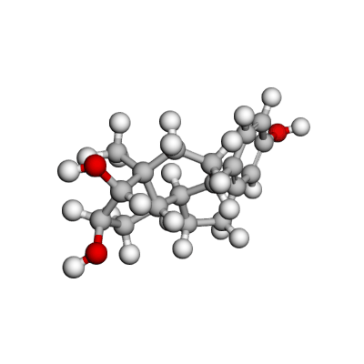 |
| Cortisol | C21H30O5 | 362.5 | 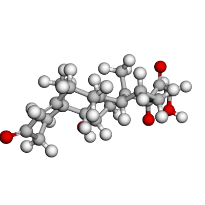 | 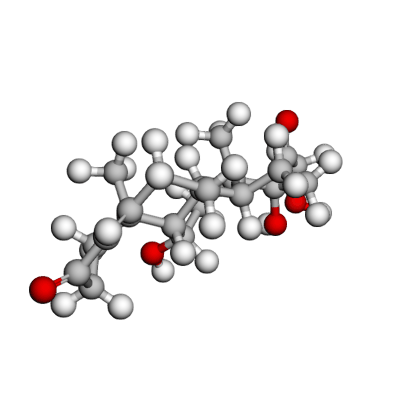 |
| Cortisone | C21H28O5 | 360.4 | 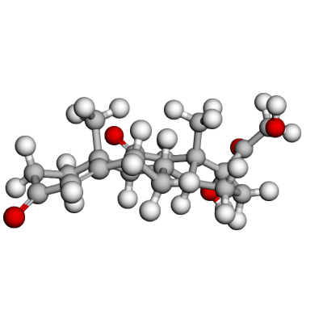 | 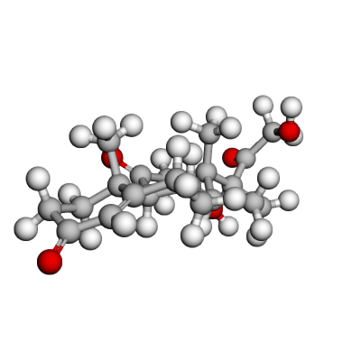 |
| Aldosterone | C21H28O5 | 360.4 | 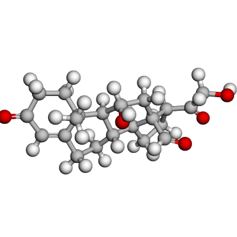 | 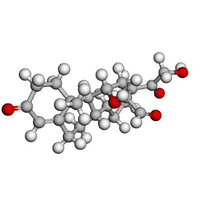 |
| Corticosterone | C21H30O4 | 346.5 | 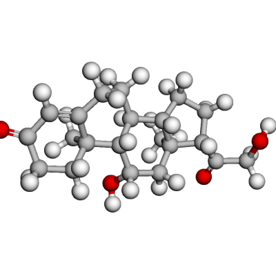 | 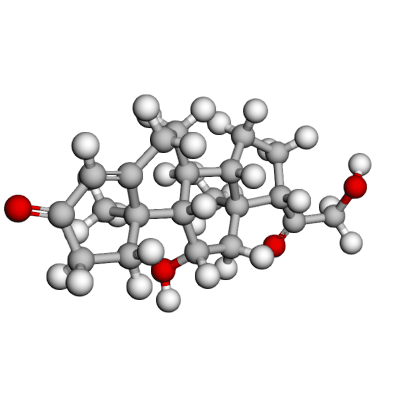 |
